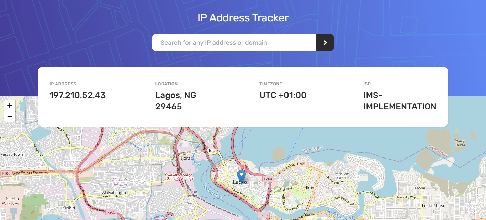

# Frontend Mentor - IP address tracker solution

This is a solution to the [IP address tracker challenge on Frontend Mentor](https://www.frontendmentor.io/challenges/ip-address-tracker-I8-0yYAH0). Frontend Mentor challenges help you improve your coding skills by building realistic projects.

## Table of contents

- [Overview](#overview)
  - [The challenge](#the-challenge)
  - [Screenshot](#screenshot)
  - [Links](#links)
- [My process](#my-process)
  - [Built with](#built-with)
  - [What I learned](#what-i-learned)
  - [Useful resources](#useful-resources)
- [Author](#author)

## Overview

### The challenge

Users should be able to:

- View the optimal layout for each page depending on their device's screen size
- See hover states for all interactive elements on the page
- See their own IP address on the map on the initial page load
- Search for any IP addresses or domains and see the key information and location

### Screenshot

### Links

- Solution URL: [Frontend Mentor](https://your-solution-url.com)
- Live Site URL: [Live Demo](https://your-live-site-url.com)

## My process

### Built with

- Semantic HTML5 markup
- Flexbox
- Mobile-first workflow
- [React](https://reactjs.org/) - JS library
- Vite
- TypeScript
- Axios
- React Custom Hooks
- Leaflet - For Map
- Tailwind CSS - For styles

### What I learned

I learned how to use leaflet and React leaflet to render solutions that involve maps. Leaflet is an open-source project, so it was very easy to implement. The docs were also pretty easy to navigate, regarding stuffs like types for Map mathods and components like LatLngExpression, LatLngTuples, etc.

### Useful resources

- [Leaflet Docs](https://leafletjs.com/)
- [React Leaflet Docs](https://react-leaflet.js.org/docs/)
- [Ipify Docs](https://geo.ipify.org/docs) - This is an IP geolocation API platform which will be instrumental in implementing solutions involving accurately detecting IP locations.

## Author

- Frontend Mentor - [@peterxavier01](https://www.frontendmentor.io/profile/peterxavier01)
- Twitter - [@peter_uadiale](https://twitter.com/peter_uadiale)
